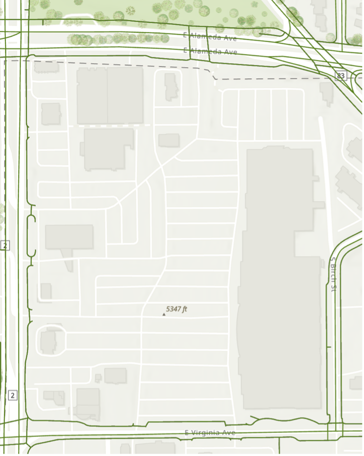

# pedestrian-networks
A series of pedestrian networks in the Denver metropolitan area

## License

This data is free for research and any other potential use with attribution to the author – Garrett Fardon

## Last Updated

2025-08-25

## Projected Coordinate System

NAD 1983 HARN StatePlane Colorado Central FIPS 0502 (US Feet)

WKID: 2877

## Sources

**DRCOG Sidewalk Centerlines 2022** ([link](https://data.drcog.org/dataset/sidewalk-centerlines-2022)): Paved sidewalk centerlines delineated from 2022 aerial imagery, along with network features such as crosswalks and likely missing sidewalks. This has been produced every two years since 2014. It includes a \`type\` field that differentiates pedestrian path types:

- **Sidewalk**: a paved path for pedestrians; most often on the side of the road
- **Crosswalk**: a marked (painted) part of the paved road where pedestrians have right of way to cross. Crosswalks within parking lots are not included.
- **Possible missing sidewalk:** an area on the side of a road where a sidewalk appears to be missing. An indication of a missing sidewalk would be existing sidewalks in the surrounding blocks. This feature should not be paved and should not cross the road. Segments with this attribution can be delineated up to 650 feet to maintain connectivity in the layer.
- **Possible missing crosswalk:** a crossing of a major street that doesn’t currently have crosswalk paint markings. Major streets are indicated by road surface markings. Segments with this attribution can be delineated up to the width of the street to maintain connectivity in the layer.
- **Other path:** is a line segment that doesn’t meet criteria for the other types but needs to be included in the data set to maintain connectivity. An example would be a sidewalk or possible missing sidewalk that breaks at a parking apron. The section that covers the parking apron would be an “other path.” Segments with this attribution can be delineated up to 650 feet to maintain connectivity in the layer.
- **Best-fit line**: a straight feature drawn through a decorative sidewalk pattern (e.g. on a school campus). It indicates that a sidewalk is there but does not trace all pedestrian possibilities.

**Harvard Streets** ([link](https://dataverse.harvard.edu/dataset.xhtml?persistentId=doi:10.7910/DVN/CUWWYJ)): A national public street network dataset, clipped to a ½ mile buffered RTD boundary and excluding streets with the type \`motorway\`, \`motorway link\` (ramps), and \`motorway & motorway link\`. Edits from source file performed by Karlyn Russell-Carlson.

## Caveats

- While the sidewalk data is provided by DRCOG, not all areas within the DRCOG boundary had sidewalk data collected. Please reference the sidewalk_extent_2022 feature class for a polygon representing the extent of the sidewalk data.
- The sidewalk data does “not include private sidewalks (i.e. serving individual residences, contained within campuses, malls, apartment complexes, mobile home parks, or commercial complexes) except where the sidewalk maintains connectivity with the public sidewalk network” (quote from DRCOG documentation). Additionally, it does not include crosswalks in parking lots. Due to this, the below datasets may not have a complete representation of the pedestrian network in large parking lots. For example, below is a screenshot of the ideal network in green surrounding the Target and PetSmart commercial development near Colorado Boulevard and Alameda Ave:
  - 
- While sidewalk data has been produced every two years, a longitudinal study may be difficult. Data in the 2014 and 2016 versions appeared to lack many sidewalks and were primarily public trails upon a brief review.

## Feature Layers with Field Descriptions

**ada_sidewalk_network**: The DRCOG sidewalk centerline layer, limited to only sidewalks with a width of 3 feet or wider or connecting elements such as crosswalks and other paths that have no width. This is intended to represent a minimum pedestrian network that can serve users with all mobility levels.

| **Name** | **Type** | **Notes** |
| --- | --- | --- |
| createdate | Date | _From DRCOG Source_: The date the attribute was created |
| createuser | Text | _From DRCOG Source_: Name of vendor creating the entity feature (Kucera International, Inc.) |
| type | Text | _From DRCOG Source_: The type of paved sidewalk or paved trail |
| comments | Text | _From DRCOG Source_: Text that explains anything a user needs to know to interpret how or why the feature was delineated (null for all values) |
| update_sta | Text | _From DRCOG Source_: how the attribute is different from the previous version of the sidewalk dataset (A: Added, M: Modify, NC: No change |
| width_feet | Numeric | _From DRCOG Source_: the width in feet of the attribute (for sidewalks) |
| Shape_Length | Numeric | The length in feet of the line |
| GlobalID | GlobalID | A unique ID for the feature class |

**complete_sidewalk_network**: The DRCOG sidewalk centerline layer, regardless of sidewalk width or connecting elements such as crosswalks and other paths that have no width. This is intended to represent the existing dedicated pedestrian infrastructure network.

| **Name** | **Type** | **Notes** |
| --- | --- | --- |
| createdate | Date | _\[From DRCOG Source\]_ The date the attribute was created |
| createuser | Text | _\[From DRCOG Source\]_ Name of vendor creating the entity feature (Kucera International, Inc.) |
| type | Text | _\[From DRCOG Source\]_ The type of paved sidewalk or paved trail |
| comments | Text | _\[From DRCOG Source\]_ Text that explains anything a user needs to know to interpret how or why the feature was delineated (null for all values) |
| update_sta | Text | _\[From DRCOG Source\]_ how the attribute is different from the previous version of the sidewalk dataset (A: Added, M: Modify, NC: No change |
| width_feet | Numeric | _\[From DRCOG Source\]_ the width in feet of the attribute (for sidewalks) |
| Shape_Length | Numeric | The length in feet of the line |
| GlobalID | GlobalID | A unique ID for the feature class |

**Ideal_network**: A combination of the DRCOG sidewalk centerline (including likely missing sidewalks and crosswalks) and Harvard streets layers. Preprocessing was performed to ensure all intersecting lines between the layers are treated as nodes. Intended to represent the broadest possible pedestrian network that is currently available to users willing to walk in streets.

| **Name** | **Type** | **Notes** |
| --- | --- | --- |
| access | Text | _\[From Harvard Source\]_ OSM tag for the legal accessibility of a feature |
| bridge | Text | _\[From Harvard Source\]_ OSM tag for whether the attribute is a bridge |
| from_ | Text | _\[From Harvard Source\]_ An OSM node reference |
| highway | Text | _\[From Harvard Source\]_ OSM tag for the type of roadway |
| junction | Text | _\[From Harvard Source\]_ OSM tag for the type of junction (eg: a roundabout) |
| key | Text | _\[From Harvard Source\]_ An OSM node reference |
| lanes | Text | _\[From Harvard Source\]_ OSM tag for the number of lanes in the roadway |
| maxspeed | Text | _\[From Harvard Source\]_ OSM tag for the speed limit on the roadway |
| name | Text | _\[From Harvard Source\]_ OSM tag for the name of the roadway |
| oneway | Text | _\[From Harvard Source\]_ OSM tag indicating if the roadway is one-way |
| osmid | Text | _\[From Harvard Source\]_ OSM unique ID |
| ref | Text | _\[From Harvard Source\]_ OSM tag for a reference number |
| to  | Text | _\[From Harvard Source\]_ An OSM node reference |
| tunnel | Text | _\[From Harvard Source\]_ OSM tag for whether the attribute is a tunnel |
| service | Text | _\[From Harvard Source\]_ OSM tag for whether the attribute is a service way |
| createdate | Date | _\[From DRCOG Source\]_ The date the attribute was created |
| createuser | Text | _\[From DRCOG Source\]_ Name of vendor creating the entity feature (Kucera International, Inc.) |
| type | Text | _\[From DRCOG Source\]_ The type of paved sidewalk or paved trail |
| comments | Text | _\[From DRCOG Source\]_ Text that explains anything a user needs to know to interpret how or why the feature was delineated (null for all values) |
| update_sta | Text | _\[From DRCOG Source\]_ how the attribute is different from the previous version of the sidewalk dataset (A: Added, M: Modify, NC: No change |
| width_feet | Numeric | _\[From DRCOG Source\]_ the width in feet of the attribute (for sidewalks) |
| Shape_Length | Numeric | The length in feet of the line |
| Source | Text | The source of the attribute (\`DRCOG Sidewalk\` or \`Harvard Streets\`) |
| GlobalID | GlobalID | A unique ID for the feature class |

**sidewalk_extent_2022**: a polygon representing the extent of the sidewalk data from DRCOG.

**Pedestrian Networks**: a geodatabase with all the above feature classes consolidated into a single database. Additionally, it includes feature datasets with ArcGIS networks generated for each network feature class described above.